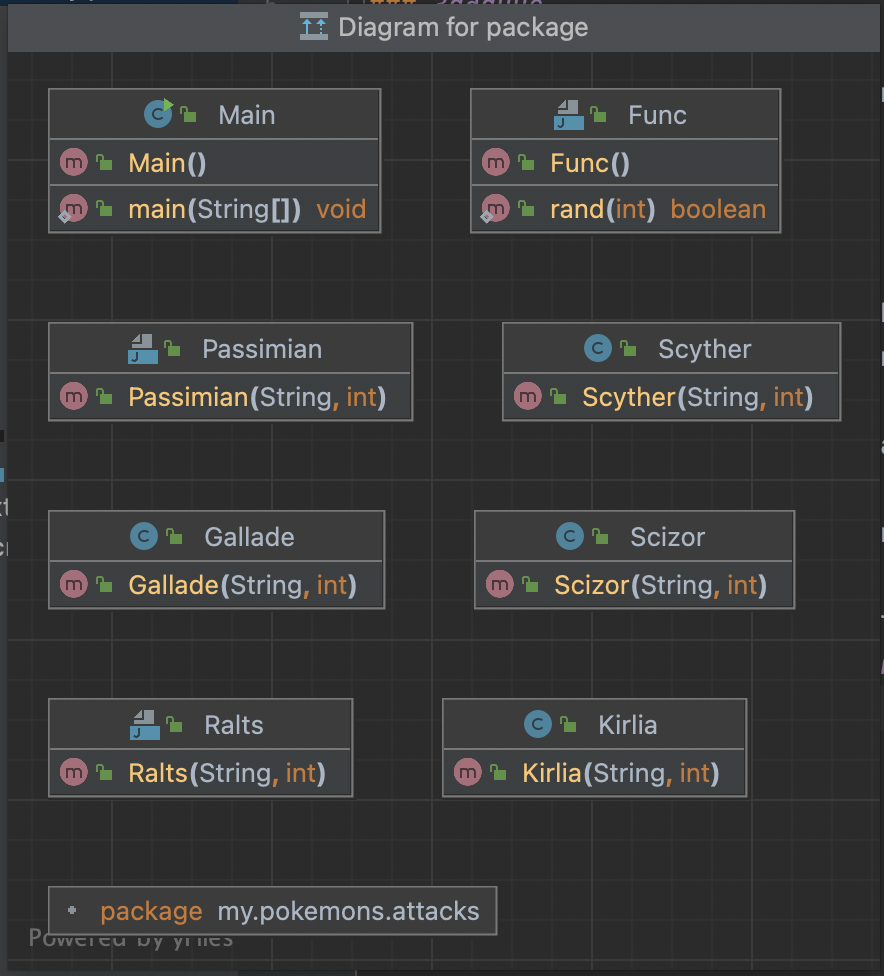
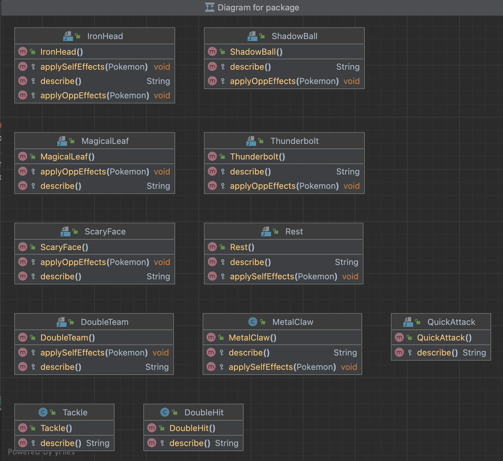

# Лабаротарная №2: Принципы ООП

---

### Задание

На основе базового класса Pokemon написать свои классы для заданных видов покемонов. Каждый вид покемона должен иметь один или два типа и стандартные базовые характеристики:

очки здоровья (HP)
атака (attack)
защита (defense)
специальная атака (special attack)
специальная защита (special defense)
скорость (speed)
Классы покемонов должны наследоваться в соответствии с цепочкой эволюции покемонов. На основе базовых классов PhysicalMove, SpecialMove и StatusMove реализовать свои классы для заданных видов атак.

Атака должна иметь стандартные тип, силу (power) и точность (accuracy). Должны быть реализованы стандартные эффекты атаки. Назначить каждому виду покемонов атаки в соответствии с вариантом. Уровень покемона выбирается минимально необходимым для всех реализованных атак.

Используя класс симуляции боя Battle, создать 2 команды покемонов (каждый покемон должен иметь имя) и запустить бой.
### Диаграмма классов реализованной объектной модели

