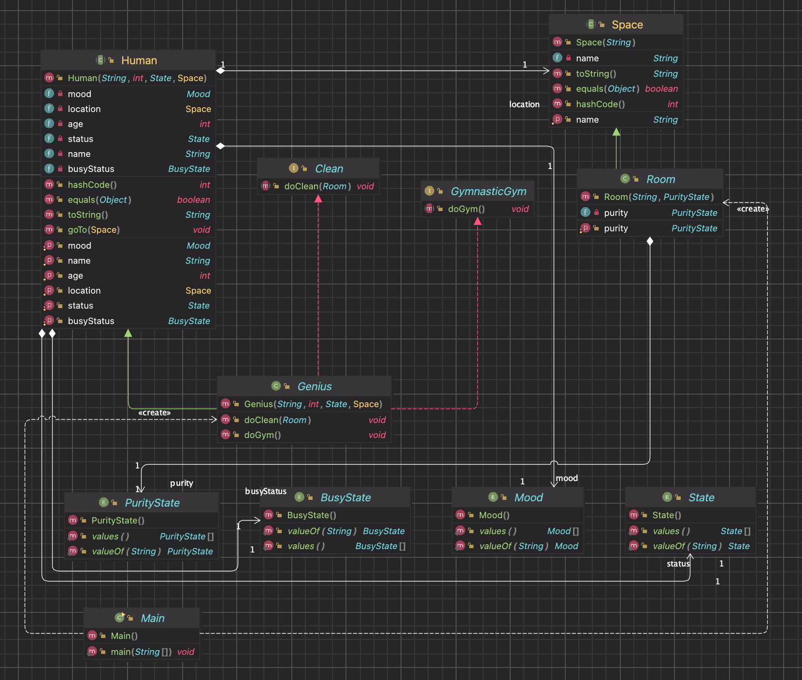

# Лабораторная №2: Принципы SOLID

---

## Текст для обьектная модели

День, в который все это произошло, начался как обычно, если не считать, что Знайка, проснувшись, встал не сразу, а, вопреки своим правилам, разрешил себе немножко поваляться в постели. Сначала ему просто было лень вставать, а потом стало казаться, будто у него не то болит не то кружится голова. Некоторое время он не понимал, болит ли у него голова оттого, что он лежит в постели, или же он лежит в постели оттого, что у него болит голова. У Знайки, однако, был свой собственный способ бороться с головной болью, а именно -- не обращать на больше никакого внимания и делать все так, будто никакой боли не было. Решив прибегнуть к этому способу, Знайка бодро вскочил с постели и принялся делать утреннюю зарядку. Проделав ряд гимнастических упражнений и умывшись холодной водой, Знайка почувствовал, что ни боли, ни головокружения у него уже не было. Настроение у Знайки улучшилось, а так как до завтрака оставалось время, он решил произвести уборку помещения: подмел пол в комнате, протер влажной тряпочкой стенные шкафы, в которых у него хранились различные химические вещества в баночках и коллекции насекомых, а главное -- разложил по полочкам книги, которые накопились у него на столе, на тумбочке возле кровати и даже на подоконнике. Это давно надо было бы сделать, да у Знайки все как-то времени не хватало.

## Диаграмма классов реализованной объектной модели

