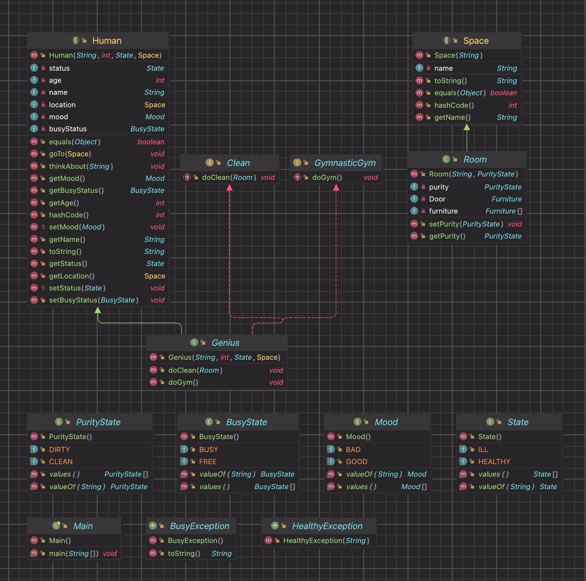

# Лабораторная №2: Исключения, вложенные, локальные, анонимные классы в JAVA

---

## Текст для обьектная модели

Все эти странные вещи озадачивали Знайку и в конце концов надоели ему. Не умея объяснить всех этих странностей, Знайка перестал изучать свойства камня и, как говорится, махнул на него рукой. Лунный камень лежал в его комнате на подоконнике, словно какая-то никому не нужная вещь, и потихонечку покрывался пылью. \\
Глава третья. Вверх дном \\ 
В дальнейшем произошли события, которые заставили Знайку и вовсе забыть на какое-то время о лунном камне. То, что случилось, было настолько удивительно и необыкновенно, что с трудом поддается описанию. Знайке, говоря попросту, было не до того, чтоб думать о каком-то камне, в котором он к тому же не видел никакого проку. День, в который все это произошло, начался как обычно, если не считать, что Знайка, проснувшись, встал не сразу, а, вопреки своим правилам, разрешил себе немножко поваляться в постели. Сначала ему просто было лень вставать, а потом стало казаться, будто у него не то болит не то кружится голова. Некоторое время он не понимал, болит ли у него голова оттого, что он лежит в постели, или же он лежит в постели оттого, что у него болит голова. У Знайки, однако, был свой собственный способ бороться с головной болью, а именно -- не обращать на больше никакого внимания и делать все так, будто никакой боли не было. Решив прибегнуть к этому способу, Знайка бодро вскочил с постели и принялся делать утреннюю зарядку. Проделав ряд гимнастических упражнений и умывшись холодной водой, Знайка почувствовал, что ни боли, ни головокружения у него уже не было. Настроение у Знайки улучшилось, а так как до завтрака оставалось время, он решил произвести уборку помещения: подмел пол в комнате, протер влажной тряпочкой стенные шкафы, в которых у него хранились различные химические вещества в баночках и коллекции насекомых, а главное -- разложил по полочкам книги, которые накопились у него на столе, на тумбочке возле кровати и даже на подоконнике. Это давно надо было бы сделать, да у Знайки все как-то времени не хватало. Убирая с подоконника книги, Знайка решил заодно убрать и валявшийся там лунный камень. Открыв шкаф, в котором у него хранилась коллекция минералов, Знайка сунул лунный камень на нижнюю полочку, так как на верхних полках не обнаружилось ни одного свободного местечка. Для этого Знайке пришлось нагнуться, а нагнувшись, он снова почувствовал легкое головокружение. 

## Диаграмма классов реализованной объектной модели

